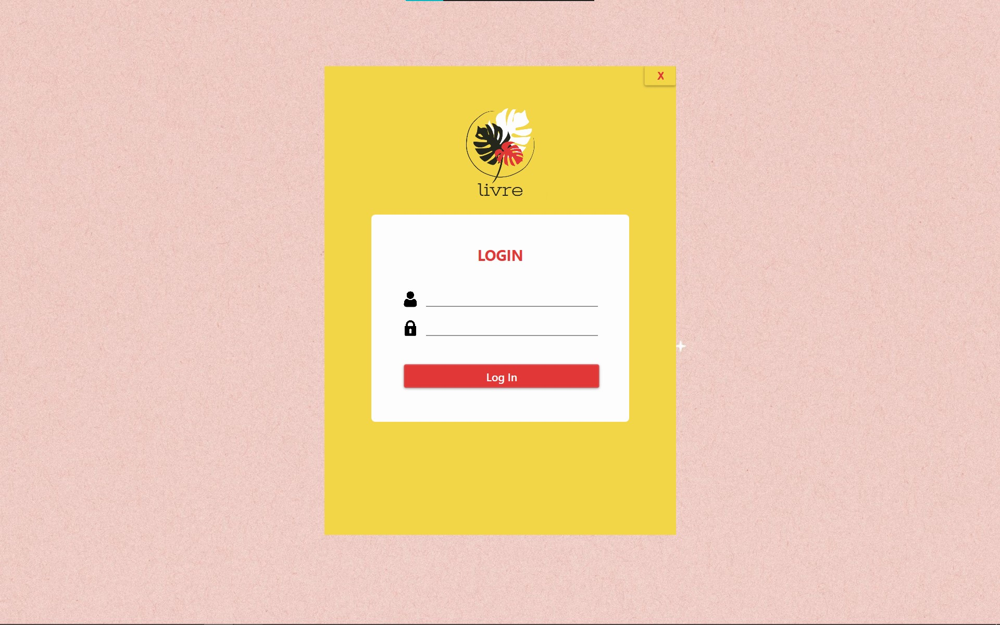
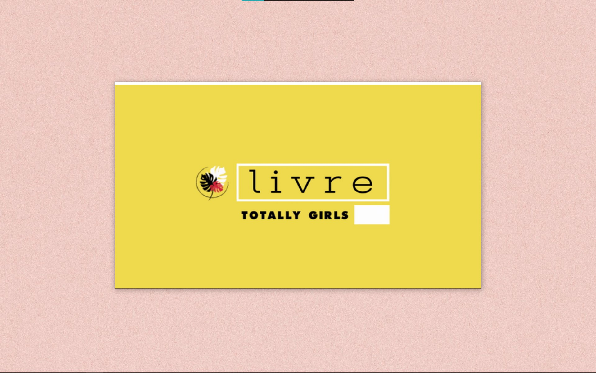
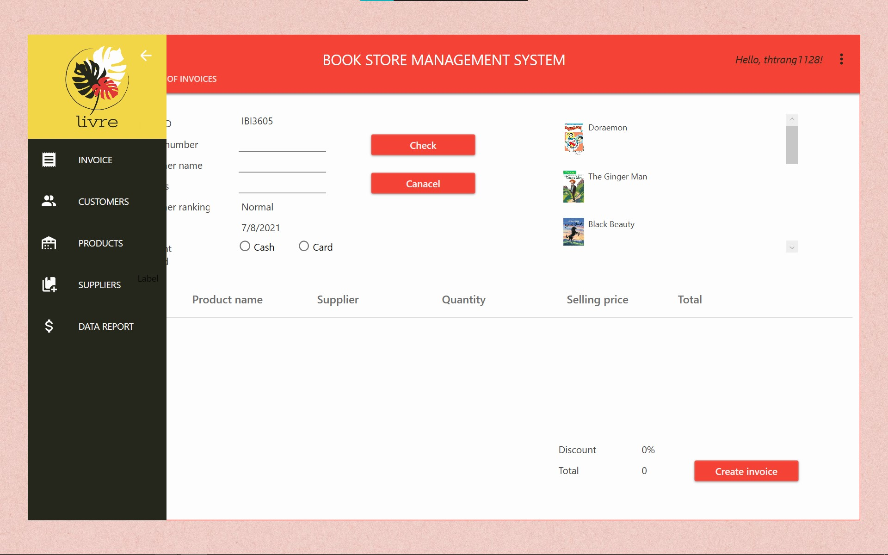
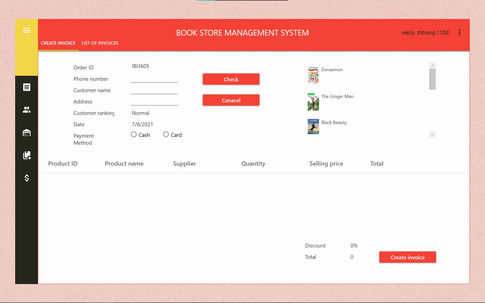
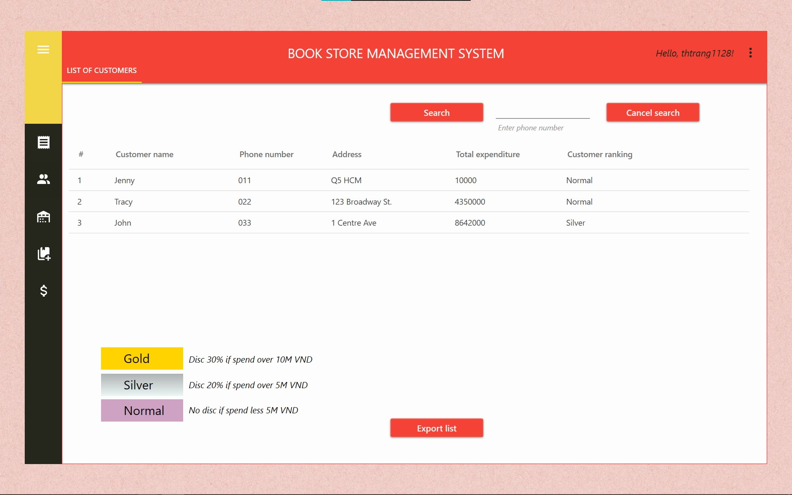
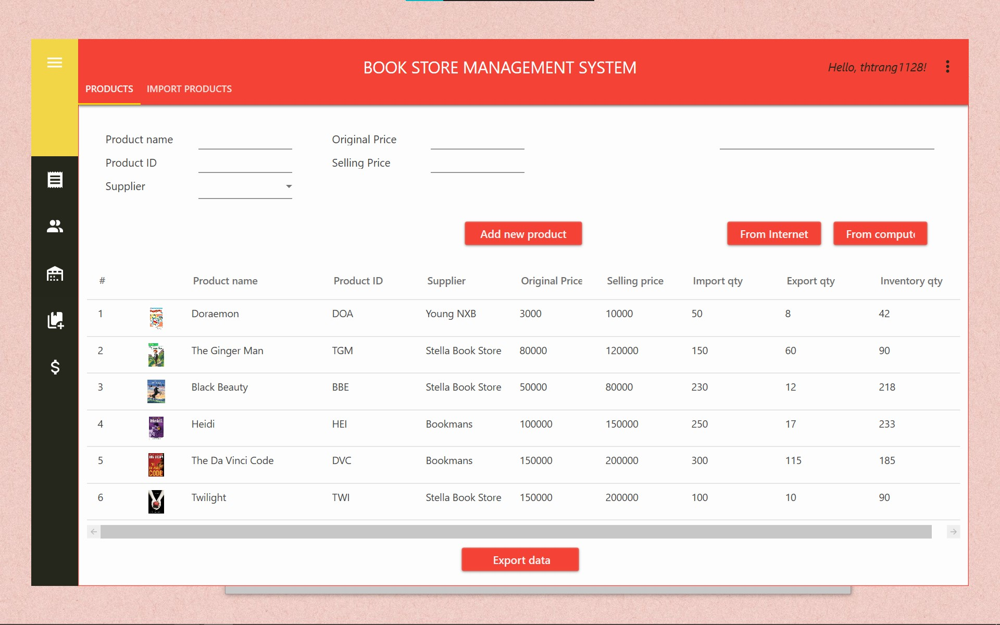
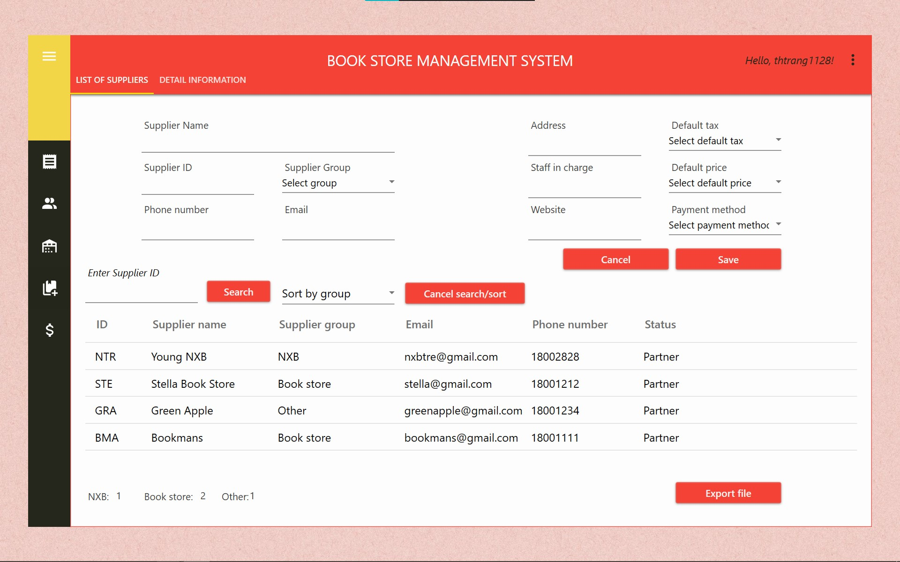
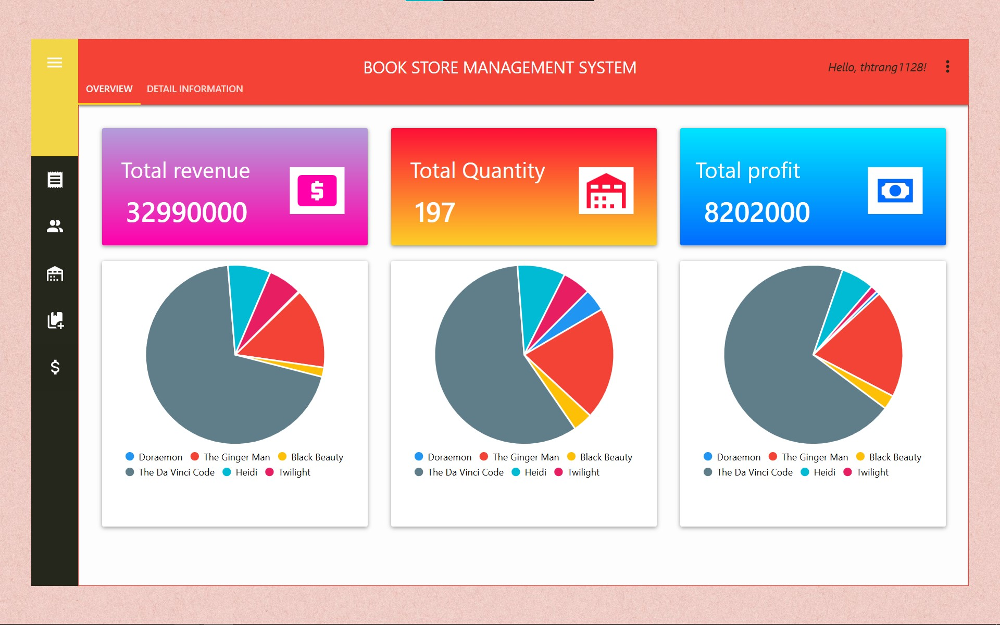

# Livre - Bookstore Management System
A convenient and easy-to-use software with functions to manage orders, customers, products, suppliers, and sales reports. Livre helps control import and export operations; make appropriate promotion policies based on customers' data; revise effective
business strategy with data visualization of sales report. Livre integrates high decentralization to ensure the security of internal information with a professional and eye-catching interface, creating a comfortable feeling for users. 

Our project achieved <b>THE HIGHEST SCORE</b> among 13 teams and developed based on .NET WPF framework. Check out <a href = "https://drive.google.com/file/d/1Y38u5YtfFi86JUDMqW-zfaaU9BHvVNNG/view?usp=sharing">demo video</a> to learn more about functionalities of Livre.

Contributors:
<ul>
<li><a href = "https://www.linkedin.com/in/trangttdang/">Trang Dang</a></li>
<li>Hanh Nguyen</li>
<li>Han Nguyen</li>
<li>Nu Le</li>
<li>Anh Nguyen</li>
</ul>
